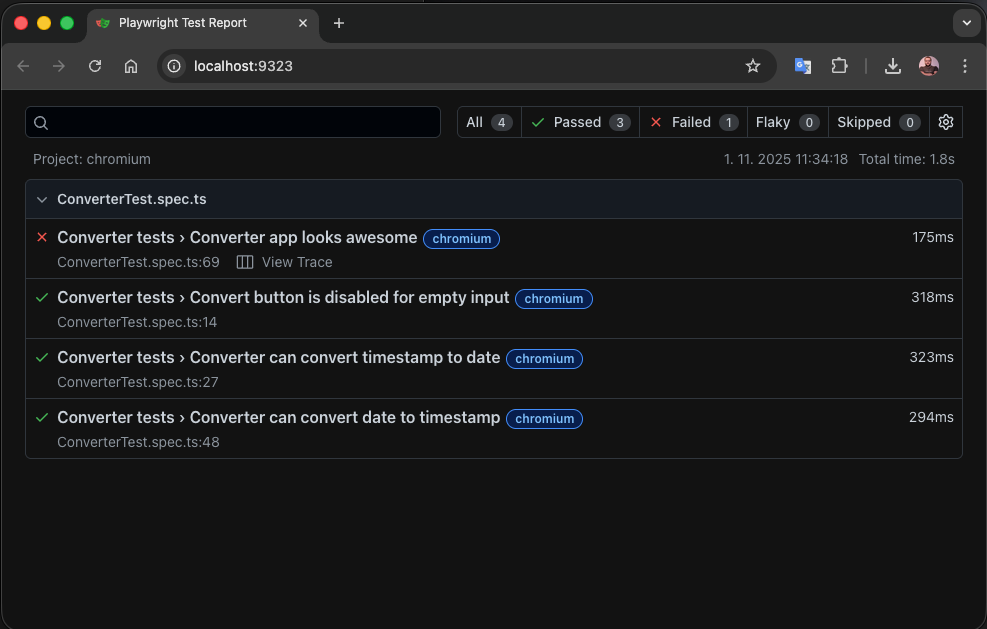
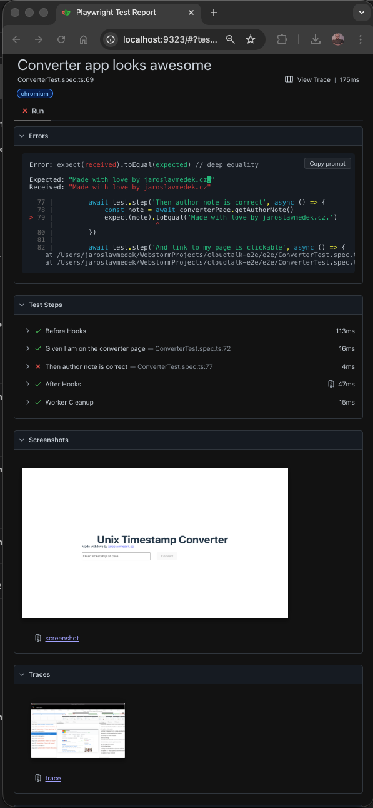
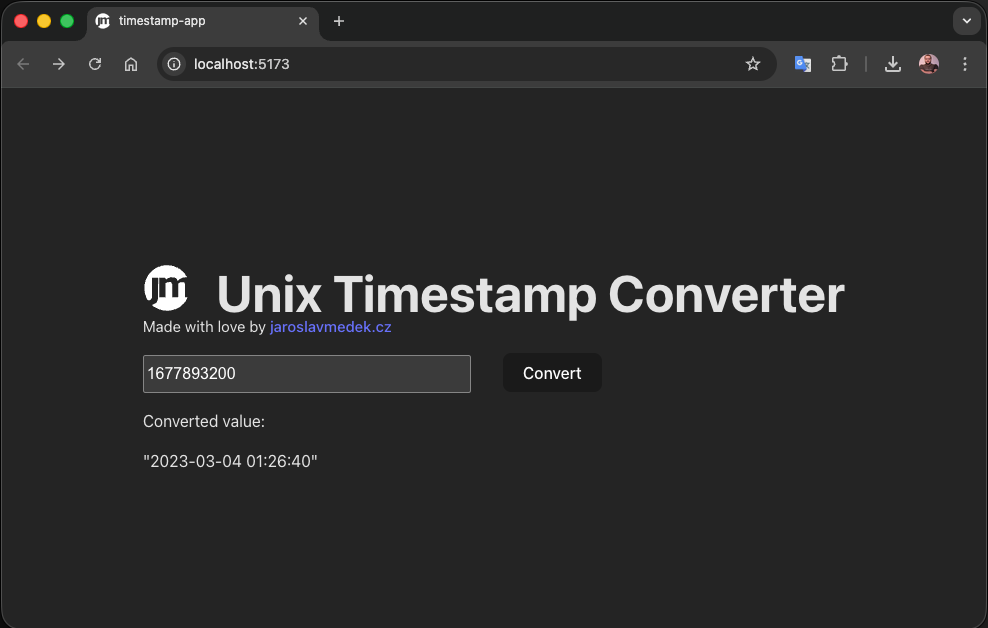

# CloudTalk E2E Tests

End-to-end test suite for testing the Timestamp Converter application using Playwright.

## Prerequisites

- Node.js (v16 or higher)
- npm

## Setup

1. Install dependencies:
```bash
npm install
```

2. Install Playwright browsers:
```bash
npx playwright install
```

## Running Tests

Make sure your application is running on `http://localhost:5173` before running the tests.

### Run all tests
```bash
npm test
```

### Run tests in UI mode
```bash
npm run test:ui
```

### Run tests in headed mode
```bash
npm run test:headed
```

## Configuration

The project is configured via `playwright.config.ts`:

- **Base URL**: from `env.BASE_URL` or defaults to`http://localhost:5173`
- **Test Directory**: `./e2e`
- **Timeout**: 10 seconds per test
- **Headless**: Enabled (browser is not visible during tests)
- **Screenshot**: Captured on test failure
- **Trace**: Captured on test failure
- **Browser**: Chromium (Firefox and WebKit commented out)

## Report
One test is purposedly failing to show the report.
Failed test contains the screenshot of the failed screen and trace from the browser for future debugging.
### Whole report

### Test


## Tested application



